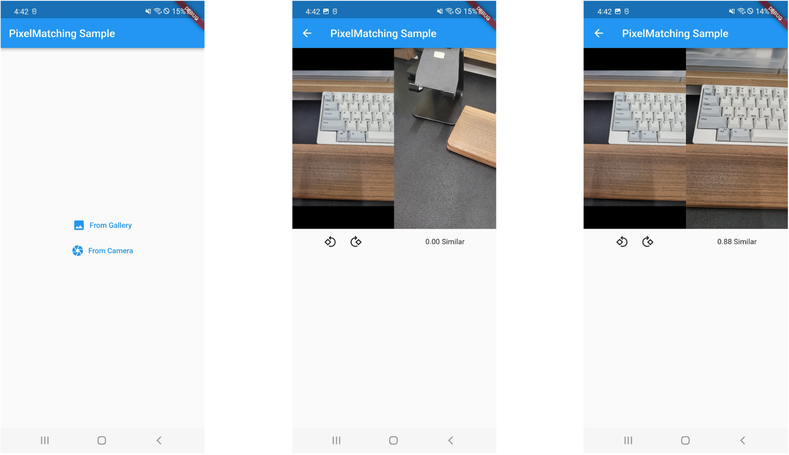

<h1 align="center">Image feature matching for Flutter</h1>

<p align="center">
<a href="https://pub.dev/packages/flutter_pixelmatching"></a>
<a href="https://opensource.org/licenses/MIT"></a>

[//]: # (<a href="https://github.com/lowapple/flutter_pixelmatching/actions"></a>)
[//]: # (<a href="https://codecov.io/gh/lowapple/flutter_pixelmatching">)
[//]: # (  )
[//]: # (</a>)
</p>

> Plugin to perform feature matching using OpenCV

An image comparison module written as an exercise in Flutter FFI and out of a need for that functionality. It is called PixelMatching, but it is actually a FeatureMatching module utilizing OpenCV. Isolate was utilized for asynchronous processing.
For the internal functionality, it was written in C++. 

The matching algorithm is using **FLannBasedMatcher**, and for the detector, **Andorid uses SIFT** **iOS uses KAZE**.

There is currently no method to change the algorithm, so if you want to change the algorithm and test it, please refer to `ios/Classes/src/ImageProcessor.cpp` and change it.
```c++
ImageProcessor::ImageProcessor() : stateCode(NotInitialized) {
    compare.setMatchers(cv::DescriptorMatcher::create(DescriptorMatcher::MatcherType::FLANNBASED));
#ifdef __ANDROID__
    compare.setDetector(cv::SIFT::create());
#elif __APPLE__
    compare.setDetector(cv::KAZE::create());
#endif
}
```

## Demo Screenshots



## Features
* [x] Plugins utilizing OpenCV
* [x] Perform image comparisons on camera streams (mobile platforms only), image files.
* [x] Compares image features to calculate and return similarity

## Supported platforms
Flutter PixelMatching is available for Android and iOS.

* Android (min SDK 24)
* iOS (min iOS version 11.0)

flutter_pixelmatching is currently written to be available only on mobile and there are no plans for other platforms.

## Getting started
### Installing dependencies
```yaml
flutter pub add flutter_pixelmatching
```
or
```yaml
dependencies:
  flutter_pixelmatching: ^1.0.0
```
#### XCode 
Symbolic errors in the archive when using the FFi module.<br/>
For this issue, check out the following link https://github.com/dart-lang/ffi/issues/41#issuecomment-645550964

**Runner -> Build Settings -> Strip Style -> change from "All Symbols" to "Non-Global Symbols"**


### Usage 
For image data passed as parameters, we support [CameraImage](https://pub.dev/packages/camera), Image from the [Image plugin](https://pub.dev/packages/image), and Uint8List of images.
```dart
final matching = PixelMatching();
// setup target image
await matching?.initialize(image: image);
// compare image 
final double? similarity = await matching?.similarity(cameraImage);
```
#### support CameraImage ImageFormatGroup
A list of currently supported ImageFormats for CameraImages. We added the YUV420 format due to issues with JPEG during recent development. 
|ImageFormatGroup|Android|iOS|
|----------------|-------|---|
|yuv420          |  ✅   | ✅|
|jpeg            |  ✅   | ✅|
|bgra8888        |  ❌   | ✅|
|nv21            |  ❌   | ❌|

## ⚠️ Issue

Currently, for ease of use, the libopencv_java4.so binary file is included inside the plugin. I know it's not recommended, but it's there so you can try it out quickly. If you are using the OpenCV module in another plugin, it may cause conflicts. Please note that.

## License
MIT License. See [LICENSE](LICENSE) for details.
